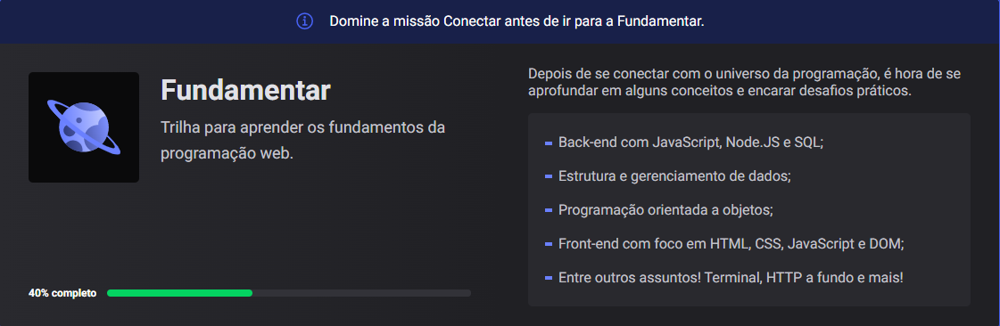
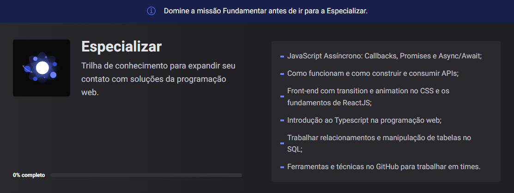

# Cursos Html Rocketseat

O universo da programação é infinito e a tecnologia não para de evoluir. Com ferramentas surgindo todos os dias o excesso de informação tiram o nosso foco e atrasam a nossa evolução.

<h2 id="menu">🚀Navegando...<h2>

<li><a href="#about">O que é a Rocketseat?</a></li> 
<li> <a href="#discover">Discover</a></li>
<li><a href="#content">Conteúdo</a></li> 
<li><a href="#exercises">Exercícios</a></li>

---

<h2 id="about">O que é a Rocketseat?<h2>

>A Rocketseat surgiu para ser um filtro para todas essas informações e servir de  guia. Somando tecnologias alinhadas com o mercado a uma jornada completa de aprendizado.

Tem o Discover para iniciantes com aulas gratuitas, o programa de aceleração Ignite para quem já domina os fundamentos da programação avançar na carreira, e o Experts Club para você manter o aprendizado contínuo.

O aprendizado é contínuo e a melhor forma de evoluir é juntos.
___

<h2 id="discover">Discover<h2>

O Discover é um programa rápido, prático e gratuito que permite entrar no universo de tecnologia para entender os principais conceitos da área de programação através de uma metodologia mão na massa, com apoio da comunidade e dos nossos instrutores. 
```
As aulas foram desenhadas em um sistema de jornada de descoberta dividido em 3 Trilhas:
```


___

___


<h2 id="content">Conteúdo<h2>

O conteúdo está agrupado em guias referentes às tecnologias em destaque:
