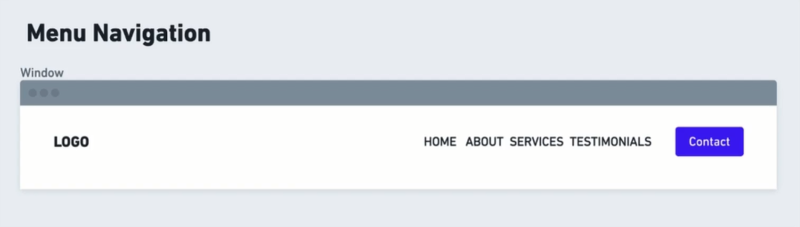
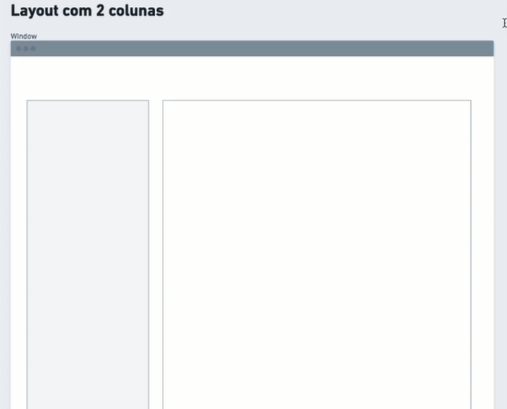
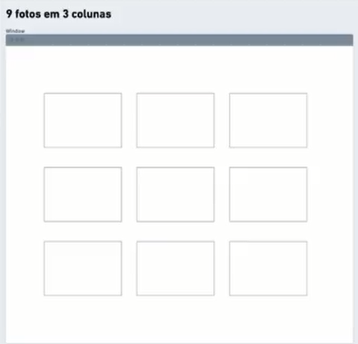

# Desafios Flexbox

>O capítulo `Alinhando os planetas` da Trilha Fundamentar é formado pelo conteúdo sobre Flexbox. Para sua conclusão foram disponibilizados alguns desafios práticos.

<h2 id="menu">Menu</h2>

<a href="#menu-nav">1. Header menu navigation</a>

<a href="#layout">2. Layout com 2 colunas</a>

<a href="#fotos">3. 9 fotos 3 colunas</a>

<a href="#button">4. Imagem dentro de um botão</a>

<a href="#footer">5. Footer</a>

---

<h2 id="menu-nav">1. Header menu navigation</h2>

* Crie o `<header>` de um site que contenha uma logo e um menu.
* Um elemento deverá ficar ao lado do outro.
* A logo ficará no extremo esquerdo e o menu no direito.
* Os itens do menu ficarão um ao lado do outro, com um espaço de .8rem entre eles.
* O último elemento do menu será um botão decontacto e poderá usar o selector: last-child para estilizar.

<h2 id="layout">2. Layout com 2 colunas</h2>

* Crie um layout com 2 colunas, uma ao lado da outra
* A coluna da esquerda deverá ter 25% do tamanho e a coluna da direita deverá ocupar todo o espaço que sobra.
* Faça  uma separação de 1rem entre os elementos.

<h2 id="fotos">3. 9 fotos 3 colunas</h2> 

* Crie uma galeria de fotos onde teremos 3 colunas e 9 fotos.
* Deixe um espaço de 8rem entre os elementos da galeria.

<h2 id="button">4. Imagem dentro de um botão</h2>

* Crie um botão que contenha um [ícone](https://www.iconfinder.com/) (img) e um texto.
* Coloque um espaço de 4rem entre os elementos.

<h2 id="footer"> 5. Footer</h2>

* Crie o `<footer>` de um site que contenha a data de criação do site.
* Usando flex, alinhe o elemento de footer bem ao meio.
* Deixe uma altura de 8rem para o footer.
* O footer deverá ficar no final da página.
